> [!NOTE]
> Explain pre-steps & setup in ReadMe. Also verify local setup.
> [Pre Steps](./ReadMe.md#pre-steps)

# Basics

```mermaid
flowchart LR
    User["🧑
**Users**
(e.g., ChatGPT Users, Copilot users, Customers, Content creators)"]
    App["📍
(YOU ARE HERE)
 **AI Application**
 Developer Perspective
(e.g., Chatbots, Copilot, AI Assistants, Smart Search)"]
    Provider["🌐
**LLM Provider**
(e.g. OpenAI, Anthropic provides APIs, GitHub)"]
    Model["**🧠
LLM Model**
(e.g., GPT-4, Claude 3, GPT-4o Copilot)"]

    User --> App
    App --> Provider
    Provider --> Model
```

## LLM Model Facts
- No knowledge other than public data used to train it
- Knowledge till the time of training, not latest 
- No memory
- No real world connection or realtime data
- Can't perform action
- Non-deterministic & Less predictable

## LLM considerations
- **Token usage**
    - Tokens can be thought of as pieces of words.
      - https://help.openai.com/en/articles/4936856-what-are-tokens-and-how-to-count-them
      - 1 token ~= 4 chars in English
      - 1-2 sentence ~= 30 tokens
    - Cost by tokens in input & output.
    - Optimize prompts. Restrict inputs.
- **Security**
  - Not inherently secure.
  - Watch what flows to LLM.

## To show
- OpenAI usage & budget in their online dashboard - https://platform.openai.com/settings/organization/usage
- OpenAI API specification - https://platform.openai.com/docs/api-reference/introduction
- Terminal logs to see the data flow.
  

-----

# Prompts

- **"User" Prompt:**
    - **Definition:** A **User Prompt** is a question or instruction given by the end user.
    - **Example:** “How can I use Spring AI in Java?”
    - The LLM processes this prompt to generate a relevant response.
    - **Use case:** Ask the model for information or specific tasks, like querying a database or generating a summary.

> [!NOTE]
> Go to tutorial 1
> [tutorial_1_0](./ReadMe.md#tutorial_1_0_simpleprompt)

- **Model Spec & Chain of commands:**
    - Reference https://openai.com/index/introducing-the-model-spec/
    - Reference https://cdn.openai.com/spec/model-spec-2024-05-08.html#follow-the-chain-of-command
    - Ordering of priorities - Platform (LLM Model) > Developer (System prompt) > User (User prompt) > Tool

- **"System" Prompt / "Developer" prompt:**
    - **Definition:** A **System Prompt** is an instruction or context given to the LLM to guide how it should respond to user inputs.
    - Reference: https://platform.openai.com/docs/guides/prompt-engineering
    - **Example:** “You are an expert in Java programming.”
    - This helps set the tone, style, or specific behavior of the LLM when it processes user inputs.
    - **Use case:** Set a role, persona, or behavior for the LLM (e.g., making it more formal, casual, or technical).

- **Why Use System Prompts?**
  - System prompts help control how the LLM responds—whether it should be formal, informal, technical, or conversational.
  - They provide additional context that can improve the quality of the response.

> [!NOTE]
> Go to tutorial 1.1

### Types/Roles of messages in prompt

| Role          | Description | OpenAI (GPT) | Anthropic (Claude) | Google Gemini | Mistral | LLaMA |
|--------------|-------------|--------------|---------------------|---------------|---------|-------|
| **System**   | Sets initial behavior, tone, or restrictions for the model. | ✅ Yes | ✅ Yes (Claude 3) | ✅ Yes | ✅ Yes | ✅ Yes |
| **User**     | The main input message from the human user. | ✅ Yes | ✅ Yes | ✅ Yes | ✅ Yes | ✅ Yes |
| **Assistant** | The model's response to the user’s message. | ✅ Yes | ✅ Yes | ✅ Yes | ✅ Yes | ✅ Yes |
| **Tool**     | Special role for tool/function calling responses. The model outputs structured data for API calls. | ✅ Yes (Function Calling) | ✅ Yes (Tool Use) | ✅ Yes | ❌ No | ❌ No |
| **Function** | Used in OpenAI for structured API responses when calling functions/tools. | ✅ Yes | ❌ No | ❌ No | ❌ No | ❌ No |
| **System Instruction** | Similar to system role but used in some models for additional instructions. | ❌ No | ✅ Yes (Claude 3) | ✅ Yes | ❌ No | ❌ No |

### Prompt Caching

#### **Why Use Prompt Caching?**
- **Faster Responses**:  
  Reusing previously cached responses reduces the need to recompute answers, leading to faster response times.  
- **Reduce Redundancy**:  
  Avoids repeating the same calculations for identical or similar inputs.  
- **Cost-Efficient**:  
  Saves processing power and API usage by reusing cached results instead of recalculating them each time.

> [!TIP]
> To realize caching benefits, place static content like instructions and examples at the beginning of your prompt, and put variable content, such as user-specific information, at the end. https://platform.openai.com/docs/guides/prompt-caching#structuring-prompts

- Open AI - Prompt caching enabled by default for all. https://platform.openai.com/docs/guides/prompt-caching
- Anthropic - For Spring & Langchain4j feature not yet implemented
  - https://github.com/spring-projects/spring-ai/issues/1403
  - https://github.com/langchain4j/langchain4j/issues/1591

-----

# LLM API Configuration Fields (OpenAI, Claude, Gemini, LLaMA, etc.)

When calling an **LLM (Large Language Model) API**, you send a request with configuration fields that control the model’s response.

| **Field** | **Description** | **Example Values** | **Supported in** |
|-----------|----------------|-------------------|------------------|
| **Max Tokens** | Sets the limit for how long the response can be. | Higher values → Longer responses (up to the model’s max limit). Lower values → Shorter, more concise answers. | All LLMs |
| **Temperature** | Controls randomness in responses. | Lower values (e.g., `0.2`) → More predictable, factual responses. Higher values (e.g., `0.8`) → More creative and varied responses. | OpenAI, Claude, Gemini, LLaMA, Mistral |
| **Top-P (Nucleus Sampling)** | Controls response diversity by setting a probability threshold. | Low values (e.g., `0.3`) → Model picks from the most likely words only. High values (e.g., `0.9`) → More diverse choices, increasing creativity. | OpenAI, Claude, Gemini, LLaMA |
| **Streaming** | Sends responses in real-time instead of waiting for full output. | `true` → Response streams as it’s generated. `false` → Response is returned all at once. | OpenAI, Claude, Gemini |
| **Context Window** | Determines how much past conversation the model remembers. | **Claude 3 Opus:** ~200K tokens. **GPT-4 Turbo:** ~128K tokens. **Gemini 1.5 Pro:** ~1M tokens. | Varies by model |
| **Tool Calling (Function Calling)** | Allows the model to call external tools/APIs. | **OpenAI:** `"tools"` for function calling. **Gemini:** `"function calling"`. **Claude:** `"tool use"`. | OpenAI, Claude, Gemini |
| **Safety Settings** | Sets filtering levels for harmful content. | `"low"`, `"medium"`, `"high"` → Controls strictness of content moderation. | OpenAI, Claude, Gemini |
| **Top-K** | Limits how many top word choices the model considers at each step. | `Top-K = 40` → Model picks the next word from the **top 40 most likely words**. Lower values (e.g., `5`) → More deterministic. Higher values (e.g., `100`) → More creative but riskier outputs. | LLaMA, Gemini, Claude |
| **Stop Sequences** | Defines words/phrases that will make the response stop early. | Example: Setting `["###"]` as a stop sequence ensures the response ends before encountering `"###"`. | OpenAI, Claude, Gemini |
| **Frequency Penalty** | Discourages repetition of words/phrases. | Higher values (e.g., `2.0`) → Less repetition, more varied language. Lower values (e.g., `0.0`) → May repeat phrases more often. | OpenAI, Gemini |
| **Presence Penalty** | Encourages new topics by discouraging words already used. | Higher values (e.g., `2.0`) → Model is more likely to introduce new ideas. Lower values (e.g., `0.0`) → Sticks to the main topic more. | OpenAI |
| **Seed** | Fixes randomness so the same input always gives the same response. | Setting `42` as a seed ensures the same reply each time for reproducibility. | OpenAI, Claude, Gemini, LLaMA |
| **Repetition Penalty** | Reduces the likelihood of repeating words or phrases. | Higher values (e.g., `2.0`) → Avoids repetition. Lower values (e.g., `1.0`) → Allows natural repetition. | Gemini, LLaMA |
| **Response Format** | Specifies output as plain text or structured data (e.g., JSON). | `"json"` → Ensures output follows JSON rules. `"text"` → Regular natural language output. | OpenAI, Gemini |
| **Logit Bias** | Allows boosting or suppressing specific words/tokens. | Example: You can bias the model to prefer `"yes"` over `"no"`. | OpenAI, Claude, Gemini |
| **Temperature Decay** | Gradually lowers the temperature as the model generates output. | Example: Starts at `0.8` (creative) and decreases to `0.2` (factual) over a long response. | LLaMA, some custom APIs |
| **Penalty Alpha** | Adjusts how much the model penalizes repetitive outputs. | Example: Higher values make responses more diverse by discouraging repetition. | Anthropic Claude |

**Notes:**  
- **Adjust either Temperature or Top-P**, not both together.  
- **Stop Sequences** help in formatting structured output.  
- **Repetition & Frequency Penalties** are useful for making responses more natural.  

| Token       | Original Prob | Temp = 0.5 | Temp = 1.5 | Top-p = 0.9 |
|-------------|----------------|------------|------------|-------------|
| **"the"**     | 0.30           | 0.45       | 0.20       | 0.33        |
| **"a"**       | 0.20           | 0.25       | 0.18       | 0.22        |
| **"cat"**     | 0.10           | 0.12       | 0.15       | 0.11        |
| **"banana"**  | 0.05           | 0.03       | 0.10       | 0.06        |
| **"sky"**     | 0.03           | 0.01       | 0.08       | 0.04        |
| **"explode"** | 0.01           | ~0.001     | 0.05       | ❌ Removed   |
| **"others"**  | 0.31           | 0.139      | 0.24       | 0.24        |

### 🔍 Sampling Controls Explained

- **`Temperature `**
    - Divide each logit by the temperature value.
    - logit' = logit / temperature
    - **`Temperature = 0.5`** → Sharper focus on most likely tokens  
          - The model becomes more deterministic, favoring high-probability words.
    - **`Temperature = 1.5`** → More randomness and creativity  
          - The model explores less common words, producing more surprising outputs.

- **`Top-p = 0.9`** → Only picks from top 90% cumulative probability  
  The model removes the long tail of unlikely tokens and chooses from the top few.

> [!NOTE]
> Go to tutorial 1.2
> [tutorial_1_2](./ReadMe.md#tutorial_1_2_simplepromptandsystempromptandconfigurations)

-----

# Context Memory

- **What is Context Memory?**
  - **Definition:** Context memory allows the model to remember previous interactions or inputs during a session.
  - **Use case:** Helps create a more natural flow in conversations by remembering the context from earlier prompts.
  - **Example:** If you ask the LLM, “Tell me about Java,” and then ask, “What about Spring Boot?” it will remember that the previous question was about Java.

- **Why Use Context Memory?**
  - Allows the model to maintain continuity across multiple user inputs.
  - Helps the model provide more relevant and accurate responses based on previous context.
  - Essential for building chatbots, assistants, or any multi-step workflows.

- **Key Concepts:**
  - **Contextual Memory:** The LLM can recall past interactions to keep the conversation coherent.
  - **State Management:** Manage the flow of data (user inputs, LLM responses) across multiple interactions.
  - **Session-based Memory:** Typically used in sessions where multiple inputs from the same user are processed.

- **Tips for Effective Use:**
  - Keep track of **relevant information**: Only store context that is useful for the task.
  - **Limit the context size**: LLMs may have a token limit, so manage how much past context you store and send with each prompt.
  - Consider **expiration** of context: Older context may become irrelevant over time, so decide when to discard or refresh memory.

> [!NOTE]
> Go to tutorial 2

## Further reading about Context Memory
- Different chat memory storage solutions - Cassandra, Neo4j, JDBC
- Context Window, Forgetting mechanism
- Long Term memory

-----

# RAG

- **What is RAG?**
  - **Definition:** RAG (Retrieval-Augmented Generation) combines retrieving relevant information from an external source and using it to generate a response.
  - **Use case:** Instead of relying solely on the model's pre-existing knowledge, RAG fetches real-time or specific data from an organization's internal data sources (like databases, knowledge bases, or document repositories) to generate more accurate, up-to-date, and context-specific responses.

- **How RAG Works:**
  - **Step 1: Retrieve** relevant information from an external source using a query.
  - **Step 2: Augment** the retrieved information by refining or adding context to it. This step may involve preprocessing the data, filtering irrelevant details, or summarizing large data before passing it to the generative model.
  - **Step 3: Generate** a response by combining the augmented information with the user's prompt.
  - This process ensures that the model provides responses based on the most relevant, up-to-date, and specific data available.

- **Vector database:**
  - To store & retrieve internal knowledge base, vector database are preferred.
  - **Why not relational or NoSQL database?**
    - relational databases or NoSQL databases can store & search based on string/text matches only.
    - In LLM world, exact text matches won't work. We need something that can do matching based on **meaning**
  - Why Use Vector Databases?  
    - **Stores embeddings** of text, images, or audio.  
    - **Uses Approximate Nearest Neighbor (ANN) search** for fast retrieval.  
    - **Handles synonyms & context** better than keyword search.  
    - **Supports multi-modal search** (e.g., searching text & images together).  

- **Embeddings**
  - Embeddings are **high-dimensional numerical representations** of words, sentences, or documents.
  - Each number in an embedding vector represents a **learned feature** or **semantic aspect** of the input text. These features are **not explicitly interpretable** like words but capture **relationships, context, and meaning**.
  - Example: A Simplified 3D Embedding Space 

**Vector Database**

| Content              | Technology Score | Food Score | AI-Specific Score | Vector (Array Format)   |
|----------------------|------------------|------------|--------------------|--------------------------|
| **"AI"**             | 0.90             | 0.10       | 0.80               | [0.90, 0.10, 0.80]        |
| **"Machine Learning"** | 0.92           | 0.12       | 0.79               | [0.92, 0.12, 0.79]        |
| **"Banana"**         | 0.20             | 0.80       | 0.10               | [0.20, 0.80, 0.10]        |
| **"Smartphone"**     | 0.95             | 0.05       | 0.30               | [0.95, 0.05, 0.30]        |

**User prompt** -->  **"Neural networks"** --> [0.91, 0.11, 0.78]

| Content              | Similarity with "Neural networks" | Vector (Array Format)   |
|----------------------|-----------------------------------|--------------------------|
| **"AI"**             | Very High ✅                       | [0.90, 0.10, 0.80]        |
| **"Machine Learning"** | Very High ✅                    | [0.92, 0.12, 0.79]        |
| **"Banana"**         | Very Low ❌                        | [0.20, 0.80, 0.10]        |
| **"Smartphone"**     | Moderate 🤔                        | [0.95, 0.05, 0.30]        |

- **Similarity Search**
  - Vector databases differ from traditional databases in the sense that they can search for similar text instead of exact match text.
  - Ex: "Largest" & "Enormous" are similar words but not exact. Vector databases can match these wods due to similarity.
  - **TopK** - topK is a parameter used in similarity search operations to specify the maximum number of nearest neighbor documents to return.
  - http://docs.spring.io/spring-ai/reference/api/vectordbs/understand-vectordbs.html#vectordbs-similarity

- **What to Watch For:**
  - **Data Privacy & Security:** Ensure that sensitive or confidential internal data is handled securely when using RAG.
  - **Relevance of Retrieved Data:** The quality of the response depends on the relevance of the data retrieved. Make sure the retrieval mechanism is well-tuned.
  - **Token Limitations:** Large data sets might exceed the model's token limit. Make sure to properly manage the amount of data you send to the model.
  - **Data Freshness:** Regularly update internal data sources to avoid relying on outdated or irrelevant information for generating responses.

> [!NOTE]
> Go to tutorial 3

## Further reading about Context Memory
- Ranking / Reranking using models like Cohere to improve similarity
- Different storages for RAG
- Different chunking strategies

-----

# Moderation

### **What is LLM Moderation?**

- **Definition**:  
  **LLM Moderation** involves using Large Language Models (LLMs) to **flag** and **score** harmful, inappropriate, or offensive content in user inputs and AI-generated outputs, rather than directly filtering or blocking content.

### **Why is LLM Moderation Important?**
- **Flag Harmful Content**:  
  Flags content that may be inappropriate, offensive, or harmful, allowing further review or action to be taken.
  
- **Ensure Safe User Interaction**:  
  Provides an additional layer of protection by identifying unsafe or damaging content before it reaches the user.
  
- **Compliance with Regulations**:  
  Helps meet legal and ethical standards regarding user-generated content.

Reference: https://platform.openai.com/docs/guides/moderation

> [!NOTE]
> Go to tutorial 9

### Further reading about Context Memory
- More Guardrails mechanisms
- PII data protection using Microsoft Presidio , Google Cloud Data Loss Prevention (DLP) 

## Observability

> [!NOTE]
> Go to tutorial 7

## Custom Model

> [!NOTE]
> Go to tutorial 8

-----
-----

# Agentic AI

## **AI Workflows vs Agents in AI**

- **Workflows** are **orchestrated through predefined code paths**, ensuring a fixed and predictable sequence of steps, which is great for well-defined tasks.
- **Agents** are more **dynamic** and **autonomous**, where the system itself decides how to approach the task and when to call tools based on the context.
- While **agents** offer autonomy and flexibility, **workflows** are often preferred in environments where **predictability**, **reliability**, and **maintainability** are crucial, especially in enterprise applications.

Reference: https://www.anthropic.com/engineering/building-effective-agents

## AI Workflows

#### **AI Workflows** (Prescriptive Systems)
- **What is it?**  
  A **workflow** is a system where **LLMs** and tools are orchestrated through **predefined code paths**. The AI follows a set sequence of steps designed by developers.
- **How it works**:  
  - The system executes specific, predefined tasks in a fixed order.
- **Key Benefits**:
  - **Predictable**: The steps are defined in advance, ensuring a consistent output.
  - **Reliable**: Works well for well-defined tasks that don’t change often.
  - **Ideal for Enterprises**: Provides **stability** and **maintainability**, which are crucial for business applications.

- Walk through this article - https://spring.io/blog/2025/01/21/spring-ai-agentic-patterns

> [!NOTE]
> Go to tutorial 5 & 6

## AI Agents (Autonomous)

#### **Agents** (Autonomous Systems)
- **What is it?**  
  An **AI agent** is a system where **LLMs** dynamically direct their own processes and decide when to use tools based on the user’s input.
- **How it works**:  
  - The **agent** operates autonomously, meaning it makes decisions about how to approach the task and which tools to use based on real-time data and context.
- **Key Benefits**:
  - **Flexible**: The system adapts to different situations and changes its behavior as needed.
  - **Autonomous**: Agents can make decisions without predefined steps.
  - **Ideal for Complex Problems**: Useful for tasks that are unclear or require adaptive problem-solving.

#### Tools / Function calling
  - Tool calling (also known as function calling) is a common pattern in AI applications allowing a model to interact with a set of APIs, or tools, augmenting its capabilities.
  - Main Uses:
    - **Information Retrieval**: Tools retrieve data from external sources (databases, web services, etc.) to enhance the model's knowledge. This is useful in scenarios, like fetching weather information or querying a database for records.  
    - **Taking Action**: Tools can automate tasks such as sending emails, creating records, or triggering workflows. Examples include booking flights, submitting forms, or generating code in a TDD scenario.

#### How Tools / Function calling Works:
- The model **requests** a tool call with input arguments.
- The **client application** executes the tool call and returns the result.
- The model does not have access to the tools or APIs directly.

#### Structured output
- Structured Outputs is a feature that ensures the model will always generate responses that adhere to your supplied JSON Schema.
- **Better parsing**: The client can easily parse and process the result
- https://platform.openai.com/docs/guides/structured-outputs
- https://ai.google.dev/gemini-api/docs/structured-output?lang=python

> [!NOTE]
> Go to tutorial 4

#### Further reading about Context Memory
- Computer Use mechanism provided by LLM
- Claude Desktop for desktop automation

----

## Model Context Protocol

### What is Model Context Protocol (MCP)
- With rise of agentic AI, lot of Agents are being developed all over for integrating with several tools, APIs etc.
- Instead of everyone creating agents from scratch, MCP standardizes a protocol to develop MCP servers & share.
- MCP protocol defines standard way in which MCP host, MCP client & MCP server interact with each other.
- This way MCP server & clients are plug & play

### **MCP Host**
  - The main application that hosts and coordinates the flow between user input, LLM, and tool execution.
  - Example: IDE, Desktop Application like Claude Desktop, Spring application

### **MCP Client**
  - Part of Spring AI, it wraps LLMs (e.g., OpenAI, Claude) and handles:
    - Prompt formatting (MCP-compliant)
    - Routing messages to LLM
    - Parsing tool requests/responses
    - Interacting 1:1 with MCP server.
- Example: https://modelcontextprotocol.io/clients

### **MCP Server**
  - Mainly this is just a integration code that integrates with Databases, APIs, File Systems etc. This integation code is wrapped with MCP server specification.
  - Even if it says "Server", it can just be a terminal sub process running in the host computer.
  - A server component that exposes tools/functions (e.g., Brave Search, Calculators).
  - Responds to tool calls triggered by LLMs & executes necessary actions or API calls.
  - Example:
      - https://github.com/modelcontextprotocol/servers  
      - https://modelcontextprotocol.io/examples
      - https://github.com/microsoft/playwright-mcp
      - https://github.com/awslabs/mcp  

### **Communication Modes**
 - 🖥️ MCP "stdio" (Standard input output)
     - MCP "stdio" lets the language model talk to tools by:
     - Sending input as **JSON through standard input (stdin)**
     - Receiving output as **JSON through standard output (stdout)**
     - ✅ No HTTP, no network — just command-line I/O!
     - ✅ Spring automatically handles launching stdio-based tools (e.g. npx commands) & communicates with that subprocess.
 - 🌐 MCP sse (Server-Sent Events)
     - 🌍 Communicates over HTTP using text/event-stream
     - The tool receives a POST request with JSON input
     - Sends streamed responses (via SSE) back to the LLM
     - Spring sets up the HTTP POST request and reads streamed SSE responses.
  
> [!NOTE]
> Go to tutorial 10

## Langchain4j

> [!NOTE]
> Go to Langchani4j Tutorials

## Further Reading / Research
- Learn about other models like audio, video, text to speech etc.
- Learn about all MCP servers available out there like JetBrains, Microsoft, Jira etc.
- Learn about MCP server with IDEs
- Learn about Claude Desktop

