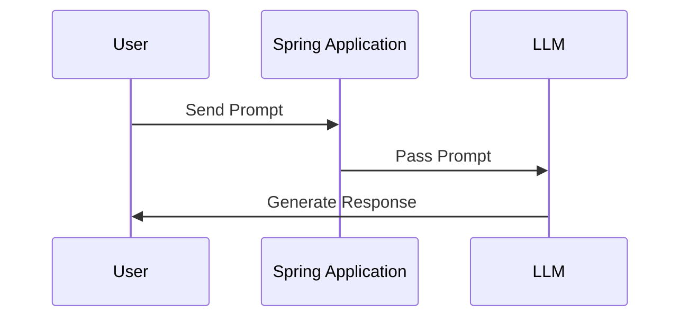
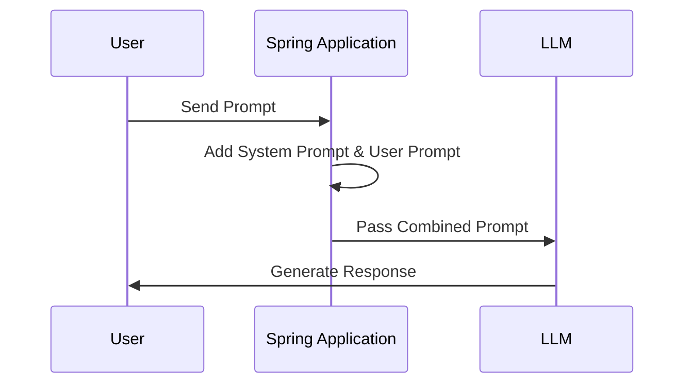
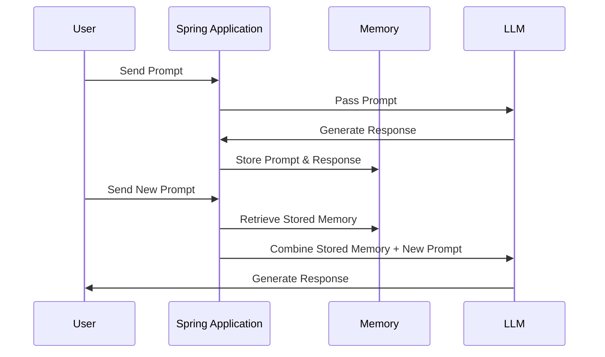
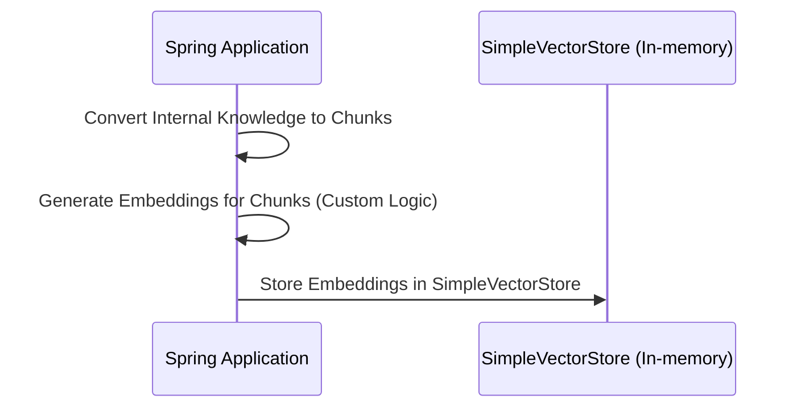
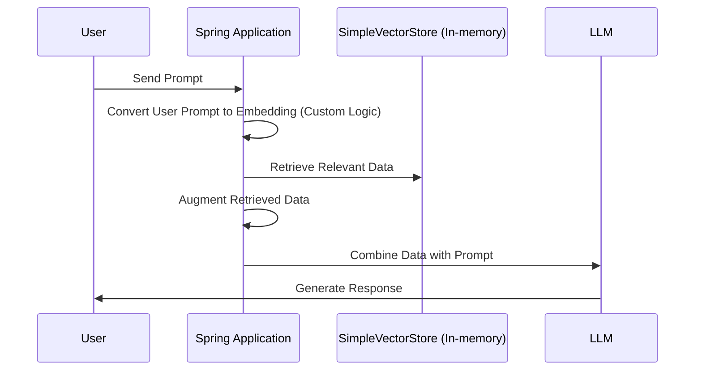
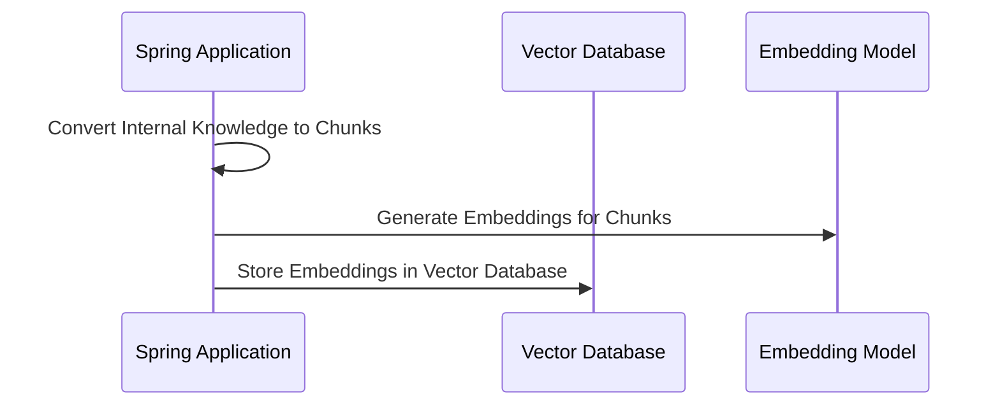
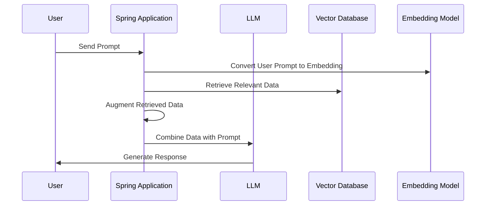
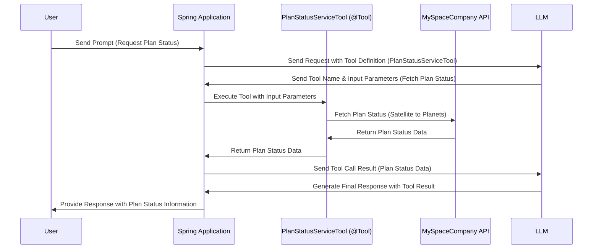

# Tutorials

## Pre-steps
- Get API keys for OpenAI & Claude
- Add balance to account to make API calls
- Create spring boot project with spring-ai-openai dependency
- As per the model you want to sue, add specific dependencies like spring-ai-anthropic-spring-boot-starter & spring-ai-openai-spring-boot-starter
- Add API keys in properties file.
- Sprig auto discovers & create ChatModel beans for configured models.

## Tutorial_1_0_SimplePrompt
- Simple single prompt input & single output
- No memory
- PROMPT = user input
- Try
  - Langchain4j - Try adding system instructions
 

http://localhost:8080/ai/spring/tutorial/1?userInput=which planet is biggest in solar system
http://localhost:8080/ai/spring/tutorial/1?userInput=how many moons does it have

http://localhost:8080/ai/langchain4j/tutorial/1?userInput=which planet is biggest in solar system
http://localhost:8080/ai/langchain4j/tutorial/1?userInput=how many moons does it have

## Tutorial_1_1_SimplePromptAndSystemPrompt
- Add system instructions either at client level or at each prompt.
- PROMPT = user input + system prompt
- Try:
  - Change system instructions to specify format of output you want like json or yaml or anything that you wish.

http://localhost:8080/ai/spring/tutorial/1.1?userInput=which planet is biggest in solar system

## Tutorial_2_PromptWithContext
- Add memory so that previous context can be retained & passed to LLM with every prompt.
- PROMPT = user input + Prior questions & answers
- Try
  - Make memory separate my user (Hint: conversation id)

http://localhost:8080/ai/spring/tutorial/2?userInput=which planet is biggest in solar system
http://localhost:8080/ai/spring/tutorial/2?userInput=how many moons does it have
http://localhost:8080/ai/spring/tutorial/2?userInput=name all moons

http://localhost:8080/ai/langchain4j/tutorial/2?userInput=which planet is biggest in solar system
http://localhost:8080/ai/langchain4j/tutorial/2?userInput=how many moons does it have
http://localhost:8080/ai/langchain4j/tutorial/2?userInput=name all moons

## Tutorial_3_0_PromptWithContextAndRag
- Add RAG so that it can use knowledge internal to organization.
- Similarity matched vector data will be sent with the prompt.
- PROMPT = user input + Prior questions & answers + retrieved data from vector database + default advise

http://localhost:8080/ai/langchain4j/tutorial/3?userInput=any plans for jupiter
http://localhost:8080/ai/langchain4j/tutorial/3?userInput=which planet is biggest in solar system

## Tutorial_3_1_PromptWithContextAndRagWIthCustomAdvise
- Custom advise about how to use RAG data
- PROMPT = user input + Prior questions & answers + retrieved data from vector database + custom advise

## Tutorial_3_2_PromptWithContextAndRagWithEmbeddingModel
- Use OpenAI embedding model to generate embeddings
- Try
  - Use embedding model to even generate embeddings of use prompt & then search for similarity.

## Tutorial_4_0_PromptWithContextRagAndTools (Agentic AI)
- Add 'Tools' so that actions can be performed.
- LLM can't perform action but it can decide & instruct back to execute action along with inputs for action.
- Spring generates schema for input to the tool
- CALL 1 PROMPT = user input + Prior questions & answers + retrieved data from vector database + default advise + tools, their description & input/output structure
- CALL 1 RESPONSE = Instruction to execute tool & input JSON for tool. (THIS RESPONSE IS NOT RETURNED TO USER)
- TOOL - Execute tool, get response & call LLM again
- CALL 2 PROMPT = user input + Prior questions & answers + retrieved data from vector database + default advise + Tools response + tools, their description & input/output structure
- CALL 2 RESPONSE = final response which can be give back to user

Here’s the corrected sequence for the **PlanStatusServiceTool** usage in the two-step process:

http://localhost:8080/ai/langchain4j/tutorial/4?userInput=which planet is biggest in solar system
http://localhost:8080/ai/langchain4j/tutorial/4?userInput=any plans for this planet

## Tutorial_5_0_AgenticRoutingWorkflow
- The Routing pattern implements intelligent task distribution, enabling specialized handling for different types of input.

## Tutorial_6_0_AgenticEvaluatorOptimizer
- The Evaluator-Optimizer pattern implements a dual-LLM process where one model generates responses while another provides evaluation and feedback in an iterative loop, similar to a human writer's refinement process
- Use multiple models to review & optimize inputs

## Tutorial_7_0_Observability.java
- Add logger to log request responses
- Inspect (or log) usage like tokens etc.

## Tutorial_8_0_CustomModel_PromptWithContext.java
- For private or in-house models, create custom model implementation with defined APIs
- Spring AI will provide all the functionalities like m=context memory, RAG integration tc.

## Tutorial_9_0_Moderation

# References
https://docs.spring.io/spring-ai/reference/api/chatclient.html
https://spring.io/blog/2025/01/21/spring-ai-agentic-patterns
https://docs.langchain4j.dev/get-started
