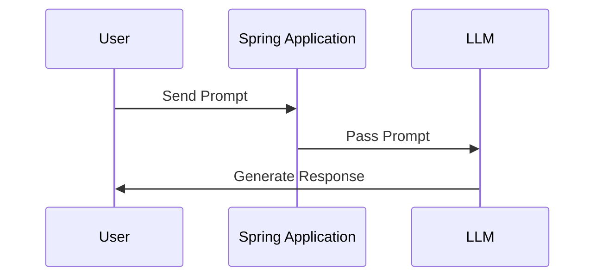
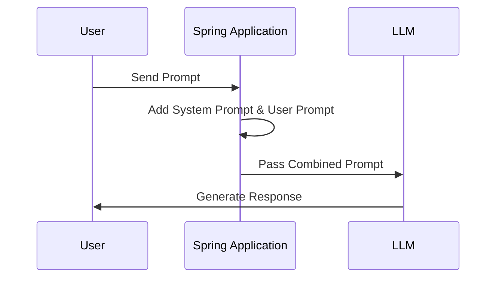
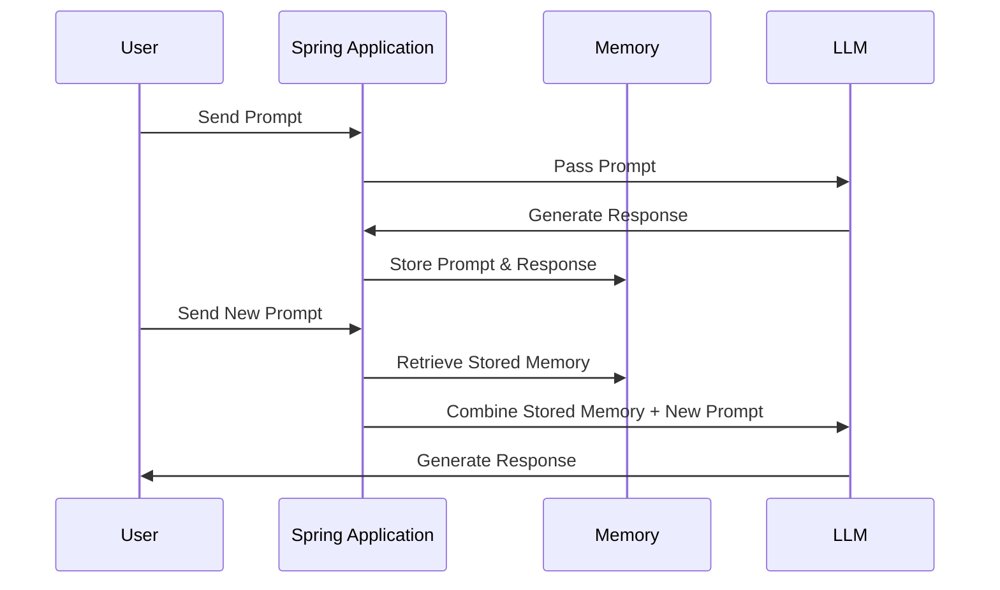
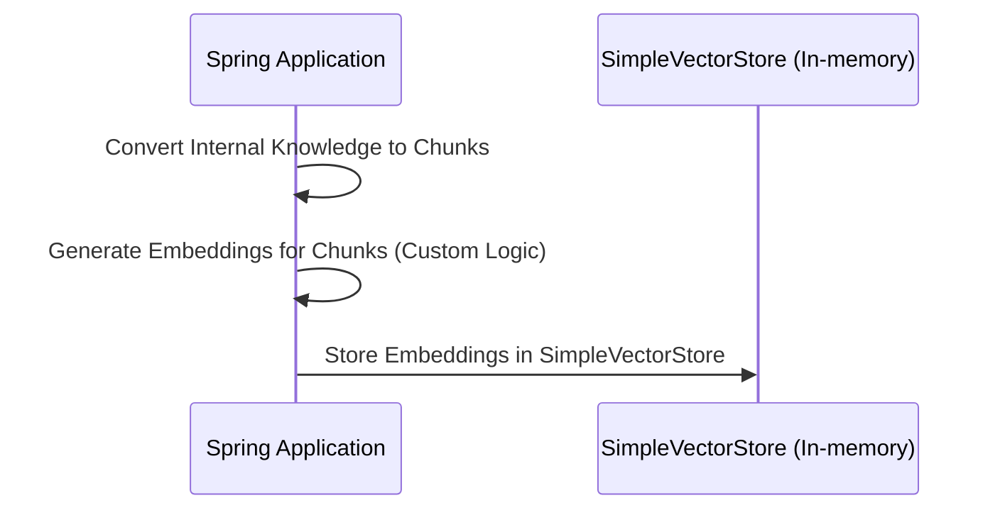
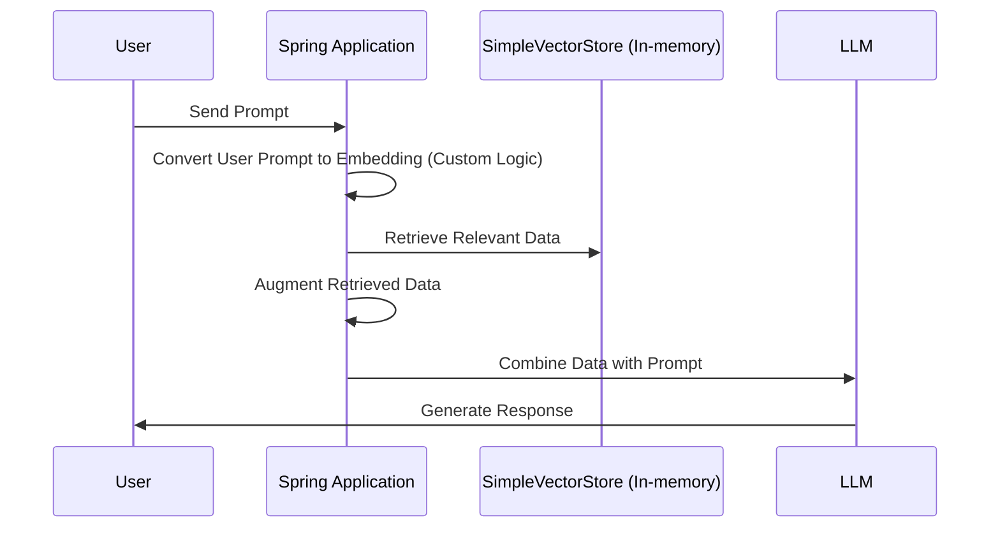
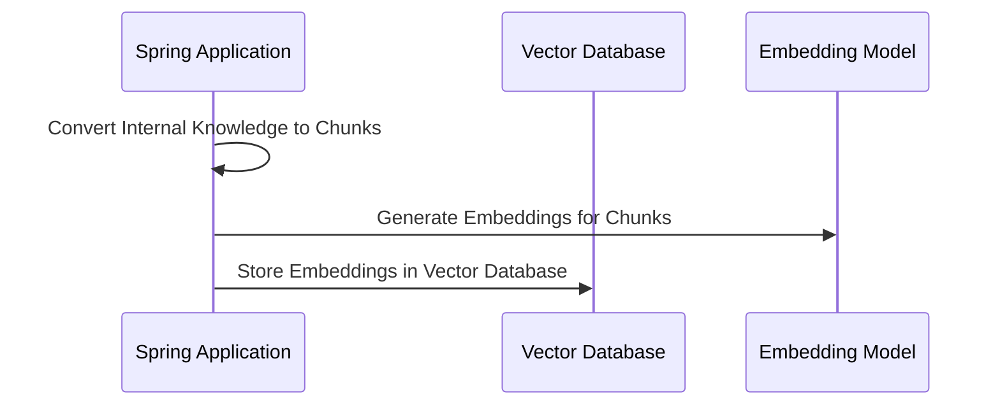
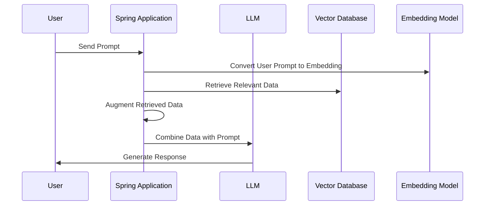
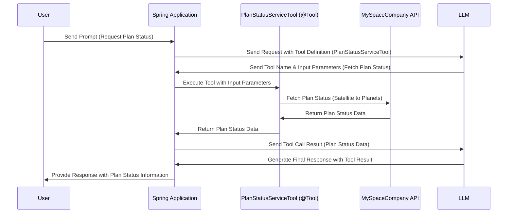

# Tutorials

## Pre-steps
- Get API keys for OpenAI & Claude
- Add balance to account to make API calls
- Create spring boot project with spring-ai-openai dependency
- As per the model you want to sue, add specific dependencies like spring-ai-anthropic-spring-boot-starter & spring-ai-openai-spring-boot-starter
- Add API keys in properties file.
- Sprig auto discovers & create ChatModel beans for configured models.

## Setup
- Install JDK 17 or latest
- Install node.js latest (Needed for MCP tutorial) https://nodejs.org/en/download/
- Have a IDE that supports Java, Gradle & Spring Boot
- Import this project into your IDE as gradle project
- Add application-dev.properties & make sure it has all API keys

```terminal
C:\Users\ravik>npm -v
11.2.0

C:\Users\ravik>npx -v
11.2.0
```

## Tutorial_1_0_SimplePrompt
> [!NOTE]
> [Explain concepts](./Concepts.md#prompts)
### Highlights
- Simple single prompt input & single output
- No memory
- PROMPT = user input

### Sequence Diagram

### Test
#### Spring
[http://localhost:8080/ai/spring/tutorial/1?userInput=which planet is biggest in solar system](http://localhost:8080/ai/spring/tutorial/1?userInput=which%20planet%20is%20biggest%20in%20solar%20system)\
[http://localhost:8080/ai/spring/tutorial/1?userInput=how many moons does it have](http://localhost:8080/ai/spring/tutorial/1?userInput=how%20many%20moons%20does%20it%20have) --> Does not remeber past conversation.  
#### Langchain4j
[http://localhost:8080/ai/langchain4j/tutorial/1?userInput=which planet is biggest in solar system](http://localhost:8080/ai/langchain4j/tutorial/1?userInput=which%20planet%20is%20biggest%20in%20solar%20system)
[http://localhost:8080/ai/langchain4j/tutorial/1?userInput=how many moons does it have](http://localhost:8080/ai/langchain4j/tutorial/1?userInput=how%20many%20moons%20does%20it%20have) --> Does not remeber past conversation.  


### Try on your own
  - Try different prompts

## Tutorial_1_1_SimplePromptAndSystemPrompt

### Highlights
- Add system instructions either at client level or at each prompt.
- PROMPT = user input + system prompt

### Sequence Diagram


### Test
[http://localhost:8080/ai/spring/tutorial/1.1?userInput=which planet is biggest in solar system](http://localhost:8080/ai/spring/tutorial/1.1?userInput=which%20planet%20is%20biggest%20in%20solar%20system)


### Try on your own
  - Change system instructions to specify format of output you want like json or yaml or anything that you wish.
  - Langchain4j - Try adding system instructions
  
## Tutorial_1_2_SimplePromptAndSystemPromptAndConfigurations

### Highlights
- Control different configurations of LLM to control generation.

### Test
[http://localhost:8080/ai/spring/tutorial/1.2?userInput=what is time&temperature=0.1](http://localhost:8080/ai/spring/tutorial/1.2?userInput=what%20is%20time&temperature=0.1)\
[http://localhost:8080/ai/spring/tutorial/1.2?userInput=what is time&temperature=0.8](http://localhost:8080/ai/spring/tutorial/1.2?userInput=what%20is%20time&temperature=0.8)\
[http://localhost:8080/ai/spring/tutorial/1.2?userInput=what is time&topP=0.9](http://localhost:8080/ai/spring/tutorial/1.2?userInput=what%20is%20time&topP=0.9)\
[http://localhost:8080/ai/spring/tutorial/1.2?userInput=what is time&topP=0.1](http://localhost:8080/ai/spring/tutorial/1.2?userInput=what%20is%20time&topP=0.1)


### Try on your own
  - Try changing values of configurations
  - Add more code for other configurations & try out hwo they control genration.
  

## Tutorial_2_PromptWithContext

### Highlights
- Add memory so that previous context can be retained & passed to LLM with every prompt.
- PROMPT = user input + Prior questions & answers


### Sequence Diagram


### Test
[http://localhost:8080/ai/spring/tutorial/2?userInput=which planet is biggest in solar system](http://localhost:8080/ai/spring/tutorial/2?userInput=which%20planet%20is%20biggest%20in%20solar%20system)\
[http://localhost:8080/ai/spring/tutorial/2?userInput=how many moons does it have](http://localhost:8080/ai/spring/tutorial/2?userInput=how%20many%20moons%20does%20it%20have)\
[http://localhost:8080/ai/spring/tutorial/2?userInput=name all moons](http://localhost:8080/ai/spring/tutorial/2?userInput=name%20all%20moons)\
[http://localhost:8080/ai/langchain4j/tutorial/2?userInput=which planet is biggest in solar system](http://localhost:8080/ai/langchain4j/tutorial/2?userInput=which%20planet%20is%20biggest%20in%20solar%20system)\
[http://localhost:8080/ai/langchain4j/tutorial/2?userInput=how many moons does it have](http://localhost:8080/ai/langchain4j/tutorial/2?userInput=how%20many%20moons%20does%20it%20have)\
[http://localhost:8080/ai/langchain4j/tutorial/2?userInput=name all moons](http://localhost:8080/ai/langchain4j/tutorial/2?userInput=name%20all%20moons)\


### Try on your own
  - Make memory separate my user (Hint: conversation id)
  
## Tutorial_3_0_PromptWithContextAndRag

### Highlights
- Add RAG so that it can use knowledge internal to organization.
- Similarity matched vector data will be sent with the prompt.
- PROMPT = user input + Prior questions & answers + retrieved data from vector database + default advise

### Sequence Diagram




### Test
[http://localhost:8080/ai/langchain4j/tutorial/3?userInput=any plans for jupiter](http://localhost:8080/ai/langchain4j/tutorial/3?userInput=any%20plans%20for%20jupiter)\
[http://localhost:8080/ai/langchain4j/tutorial/3?userInput=which planet is biggest in solar system](http://localhost:8080/ai/langchain4j/tutorial/3?userInput=which%20planet%20is%20biggest%20in%20solar%20system)\


### Try on your own
  -
  

## Tutorial_3_1_PromptWithContextAndRagWIthCustomAdvise

### Highlights
- Custom advise about how to use RAG data
- PROMPT = user input + Prior questions & answers + retrieved data from vector database + custom advise

## Tutorial_3_2_PromptWithContextAndRagWithEmbeddingModel

### Highlights
- Use OpenAI embedding model to generate embeddings
- Try
  - Use embedding model to even generate embeddings of use prompt & then search for similarity.

### Sequence Diagram



## Tutorial_4_0_PromptWithContextRagAndTools (Agentic AI)

### Highlights
- Add 'Tools' so that actions can be performed.
- LLM can't perform action but it can decide & instruct back to execute action along with inputs for action.
- Spring generates schema for input to the tool
- CALL 1 PROMPT = user input + Prior questions & answers + retrieved data from vector database + default advise + tools, their description & input/output structure
- CALL 1 RESPONSE = Instruction to execute tool & input JSON for tool. (THIS RESPONSE IS NOT RETURNED TO USER)
- TOOL - Execute tool, get response & call LLM again
- CALL 2 PROMPT = user input + Prior questions & answers + retrieved data from vector database + default advise + Tools response + tools, their description & input/output structure
- CALL 2 RESPONSE = final response which can be give back to user

### Sequence Diagram


### Test
[http://localhost:8080/ai/spring/tutorial/4?userInput=which planet is biggest in solar system](http://localhost:8080/ai/spring/tutorial/4?userInput=which%20planet%20is%20biggest%20in%20solar%20system)\
[http://localhost:8080/ai/spring/tutorial/4?userInput=any plans for this planet](http://localhost:8080/ai/spring/tutorial/4?userInput=any%20plans%20for%20this%20planet)\


[http://localhost:8080/ai/langchain4j/tutorial/4?userInput=which planet is biggest in solar system](http://localhost:8080/ai/langchain4j/tutorial/4?userInput=which%20planet%20is%20biggest%20in%20solar%20system)\
[http://localhost:8080/ai/langchain4j/tutorial/4?userInput=any plans for this planet](http://localhost:8080/ai/langchain4j/tutorial/4?userInput=any%20plans%20for%20this%20planet)\


### Try on your own
  -

## Tutorial_4_1_AgentToolForWeatherService

### Highlights
- Add 'Tools' for weather service with little bit complex input schema

### Test
[http://localhost:8080/ai/spring/tutorial/4.1?userInput=What is the weather in san francisco](http://localhost:8080/ai/spring/tutorial/4.1?userInput=What%20is%20the%20weather%20in%20san%20francisco)\
[http://localhost:8080/ai/spring/tutorial/4.1?userInput=What is the weather in la](http://localhost:8080/ai/spring/tutorial/4.1?userInput=What%20is%20the%20weather%20in%20la)\
[http://localhost:8080/ai/spring/tutorial/4.1?userInput=What is the weather in la tomorrow](http://localhost:8080/ai/spring/tutorial/4.1?userInput=What%20is%20the%20weather%20in%20la%20tomorrow)\
[http://localhost:8080/ai/spring/tutorial/4.1?userInput=What is the weather in la day after tomorrow](http://localhost:8080/ai/spring/tutorial/4.1?userInput=What%20is%20the%20weather%20in%20la%20day%20after%20tomorrow)\
[http://localhost:8080/ai/spring/tutorial/4.1?userInput=What is the weather in la 8 days from now](http://localhost:8080/ai/spring/tutorial/4.1?userInput=What%20is%20the%20weather%20in%20la%208%20days%20from%20now)


## Tutorial_5_0_AgenticRoutingWorkflow

### Highlights
- The Routing pattern implements intelligent task distribution, enabling specialized handling for different types of input.

### Test

## Tutorial_6_0_AgenticEvaluatorOptimizer

### Highlights
- The Evaluator-Optimizer pattern implements a dual-LLM process where one model generates responses while another provides evaluation and feedback in an iterative loop, similar to a human writer's refinement process
- Use multiple models to review & optimize inputs

### Test

## Tutorial_7_0_Observability.java

### Highlights
- Add logger to log request responses
- Inspect (or log) usage like tokens etc.

### Test

## Tutorial_8_0_CustomModel_PromptWithContext.java

### Highlights
- For private or in-house models, create custom model implementation with defined APIs
- Spring AI will provide all the functionalities like m=context memory, RAG integration tc.

### Test

## Tutorial_9_0_Moderation

### Highlights

### Test

## Tutorial_10_0_ModelContextProtocol

### Highlights
- Integrate with Brave Web Search API using MCP Server
- Brave Web Search MCP Server - https://github.com/modelcontextprotocol/servers/tree/main/src/brave-search
- Brave Web Search API key - https://api-dashboard.search.brave.com/app/keys
- Spring MCP Client - https://docs.spring.io/spring-ai/reference/api/mcp/mcp-client-boot-starter-docs.html

### Test
[http://localhost:8080/ai/spring/tutorial/1?userInput=what is the latest version of java](http://localhost:8080/ai/spring/tutorial/1?userInput=what%20is%20the%20latest%20version%20of%20java)  --> Without MCP

[http://localhost:8080/ai/spring/tutorial/10?userInput=what is the latest version of java](http://localhost:8080/ai/spring/tutorial/10?userInput=what%20is%20the%20latest%20version%20of%20java) --> With MCP

### Try on your own
- Try to integrate any other MCP server. Reference - https://modelcontextprotocol.io/examples  https://github.com/modelcontextprotocol/servers

# References
https://docs.spring.io/spring-ai/reference/api/chatclient.html
https://spring.io/blog/2025/01/21/spring-ai-agentic-patterns
https://docs.langchain4j.dev/get-started
