```mermaid

sequenceDiagram
    participant User
    participant SpringApp
    participant ClaudeLLM
    participant OpenAILLM

    User->>SpringApp: Send input question
    SpringApp->>OpenAILLM: Generate initial response
    OpenAILLM-->>SpringApp: Initial response

    SpringApp->>ClaudeLLM: Review OpenAI’s response with review prompt
    ClaudeLLM-->>SpringApp: Review feedback / revision instructions

    SpringApp->>OpenAILLM: Revise response using Claude's instructions
    OpenAILLM-->>SpringApp: Final optimized response

    SpringApp-->>User: Final Answer

```  

# Setup

## Completed Pre-steps (Only FYI)
- Acquired API keys for OpenAI & Claude
- Added balance to account to make API calls
- Created spring boot project with spring-ai-openai dependency
- As per the model we want to use, added specific dependencies like spring-ai-anthropic-spring-boot-starter & spring-ai-openai-spring-boot-starter
- Added API keys in properties file.
- Sprig auto discovers & create ChatModel beans for configured models.

## Setup
- IDE
    - Install a IDE that supports Java, Gradle & Spring Boot
    - IntelliJ Community Edition (Free)
        - Windows: https://www.jetbrains.com/idea/download/?section=windows
        - macOS: https://www.jetbrains.com/idea/download/?section=mac
- Setup tutorial code
    - If you have Git installed in your machine Clone this GitHub repository
    - If you don't have Git installed, then get code using download ZIP option in GitHub
    - Go to File > New > Project from Existing Sources > select the location where tutorial code has been cloned or downloaded.
    - Select Gradle as a build tool option & then import project.
- Install JDK 17 or latest
    - Getting JDK In IntelliJ:
        - Go to File > Project Structure > Platform Settings > SDKs > Click + icon > Download JDK
        - Set Version = 17
        - Set Vendor = JetBrains Runtime (17.0.14)   ---> Version might differ, but take 17 or latest.
        - Location = Keep default
        - Download
    - Setup Project SDK
        - Go to File > Project Structure > Project
        - Set SDK = Newly downloaded JDK
    - Setup Gradle
        - Go to File > Settings > Build, Execution, Deployment > Gradle
        - Set Gradle JVM = Project SDK ---> This should show newly downloaded JDK.
- Install node.js latest
    - This is needed for MCP tutorial. If you don't have this then you can skip MCP tutorial.
    - https://nodejs.org/en/download/
- (Optional) Install MongoDB Compass
    - This is not needed for execution of tutorial. In case you are interested in seeing MongoDB vector data for RAG tutorial then you can install this.
    - https://www.mongodb.com/try/download/compass 


```terminal
C:\Users\ravik>npm -v
11.2.0

C:\Users\ravik>npx -v
11.2.0
```

## Server startup
- Get additional files:
    - Add application-dev.properties to "src/main/resources" & make sure it has all API keys
    - https://1drv.ms/f/c/45c51075dd4f76ae/EsJW7ZDuhSxCoLv5OXtqX-sB9h-Y4a-P-xWGR14VWgd3Dg?e=8FnT3X    (Password will be provided in person during tutorial)
    - In mcp-servers-config.json at "src/main/resources", change "command" to the newly installed nodejs directory's npx executable. npx executable is generally in same directory as npm executable.
- IntelliJ
    - Go to Run > Edit Configurations > Click + icon > Select Application
    - JDK = JDK 17
    - -cp = spring-ai-app.main
    - Main Class = com.itsallbinary.tutorial.ai.spring_ai_app.SpringAiAppApplication
- Add VM Option to set dev profile:  -Dspring.profiles.active=dev
- Add environment variable: BRAVE_API_KEY={{API key from application-dev.properties}}

## Libraries
Libraries like **LangChain4j** and **Spring AI** simplify the development of AI-powered applications by providing tools to interact with LLMs (Large Language Models). They offer frameworks to integrate tasks like prompt engineering, function calling, and context management, making it easier to build complex AI workflows without having to manage low-level details.

### Key Benefits:
- **Ease of use**: Simplifies interacting with LLMs.
- **Context management**: Helps with maintaining conversation history or context.
- **Function calling**: Allows models to call external APIs and services.
- **Standardization**: Provides consistent API calls across different platforms.
- **Extensibility**: Facilitates adding custom tools and modules.

### References:
https://docs.spring.io/spring-ai/reference/index.html  
https://docs.langchain4j.dev/intro  

> [!NOTE]
> [Explain Basic concepts](./Concepts.md#basics)

-----
-----

# Tutorials

## Tutorial_1_0_SimplePrompt
> [!NOTE]
> [Explain concepts](./Concepts.md#prompts)
### Highlights
- Simple single prompt input & single output
- No memory
- LLM Request = user input

### Sequence Diagram

### Test
#### Spring
[http://localhost:8080/ai/spring/tutorial/1?userInput=which planet is biggest in solar system](http://localhost:8080/ai/spring/tutorial/1?userInput=which%20planet%20is%20biggest%20in%20solar%20system)\
[http://localhost:8080/ai/spring/tutorial/1?userInput=how many moons does it have](http://localhost:8080/ai/spring/tutorial/1?userInput=how%20many%20moons%20does%20it%20have) --> Does not remeber past conversation.  

#### Langchain4j
[http://localhost:8080/ai/langchain4j/tutorial/1?userInput=which planet is biggest in solar system](http://localhost:8080/ai/langchain4j/tutorial/1?userInput=which%20planet%20is%20biggest%20in%20solar%20system)
[http://localhost:8080/ai/langchain4j/tutorial/1?userInput=how many moons does it have](http://localhost:8080/ai/langchain4j/tutorial/1?userInput=how%20many%20moons%20does%20it%20have) --> Does not remeber past conversation.  


### Try on your own
  - Ask prompts to confirm the 'LLM Model Facts' that we went through
  - Try modifying code to use Anthropic Model. https://docs.spring.io/spring-ai/reference/api/chat/anthropic-chat.html#_sample_controller
  - Try different prompts

## Tutorial_1_1_SimplePromptAndSystemPrompt

### Highlights
- Add system instructions either at client level or at each prompt.
- LLM Request = user input + system prompt

### Sequence Diagram


### Test
[http://localhost:8080/ai/spring/tutorial/1.1?userInput=which planet is biggest in solar system](http://localhost:8080/ai/spring/tutorial/1.1?userInput=which%20planet%20is%20biggest%20in%20solar%20system)


### Try on your own
  - Change system instructions to specify format of output you want like json or yaml or anything that you wish.
  - Test chain of command. Give some restrictive system instructions & try giving conflicting prompt. For ex: Give system instructions to answer only about java but ask non java prompts. Test & make system instructions robust.
  - Langchain4j - Try adding system instructions
  
## Tutorial_1_2_SimplePromptAndSystemPromptAndConfigurations

### Highlights
- Control different configurations of LLM to control generation.
- LLM Request = user input + system prompt + configurations

### Test
[http://localhost:8080/ai/spring/tutorial/1.2?userInput=what is time&temperature=0.1](http://localhost:8080/ai/spring/tutorial/1.2?userInput=what%20is%20time&temperature=0.1)  
[http://localhost:8080/ai/spring/tutorial/1.2?userInput=what is time&temperature=0.8](http://localhost:8080/ai/spring/tutorial/1.2?userInput=what%20is%20time&temperature=0.8)    
[http://localhost:8080/ai/spring/tutorial/1.2?userInput=what is time&topP=0.9](http://localhost:8080/ai/spring/tutorial/1.2?userInput=what%20is%20time&topP=0.9)\
[http://localhost:8080/ai/spring/tutorial/1.2?userInput=what is time&topP=0.1](http://localhost:8080/ai/spring/tutorial/1.2?userInput=what%20is%20time&topP=0.1)


### Try on your own
  - Try changing values of configurations
  - Add more code for other configurations & try out how they control generation.
  

## Tutorial_2_PromptWithContext

### Highlights
- Add memory so that previous context can be retained & passed to LLM with every prompt.
- LLM Request = user input + Prior questions & answers


### Sequence Diagram


### Test

#### Spring
[http://localhost:8080/ai/spring/tutorial/2?userInput=which planet is biggest in solar system](http://localhost:8080/ai/spring/tutorial/2?userInput=which%20planet%20is%20biggest%20in%20solar%20system)  
[http://localhost:8080/ai/spring/tutorial/2?userInput=how many moons does it have](http://localhost:8080/ai/spring/tutorial/2?userInput=how%20many%20moons%20does%20it%20have)  
[http://localhost:8080/ai/spring/tutorial/2?userInput=name all moons](http://localhost:8080/ai/spring/tutorial/2?userInput=name%20all%20moons)  

#### langchain4j
[http://localhost:8080/ai/langchain4j/tutorial/2?userInput=which planet is biggest in solar system](http://localhost:8080/ai/langchain4j/tutorial/2?userInput=which%20planet%20is%20biggest%20in%20solar%20system)  
[http://localhost:8080/ai/langchain4j/tutorial/2?userInput=how many moons does it have](http://localhost:8080/ai/langchain4j/tutorial/2?userInput=how%20many%20moons%20does%20it%20have)  
[http://localhost:8080/ai/langchain4j/tutorial/2?userInput=name all moons](http://localhost:8080/ai/langchain4j/tutorial/2?userInput=name%20all%20moons)  


### Try on your own
  - Make memory separate my user (Hint: conversation id. Lookup spring documentation for chat_memory_conversation_id)
  
## Tutorial_3_0_PromptWithContextAndRag

### Highlights
- Add RAG so that it can use knowledge internal to organization.
- Similarity matched vector data will be sent with the prompt.
- LLM Request = user input + Prior questions & answers + retrieved data from vector database + default advise

### Sequence Diagram


### Test

#### spring
[http://localhost:8080/ai/spring/tutorial/3?userInput=Plan document for planet Jupiter](http://localhost:8080/ai/spring/tutorial/3?userInput=Plan%20document%20for%20planet%20Jupiter) ----> Use exact same sentence from document as query  
[http://localhost:8080/ai/spring/tutorial/3?userInput=what is the plan for jupiter planet](http://localhost:8080/ai/spring/tutorial/3?userInput=what%20is%20the%20plan%20for%20jupiter%20planet) ----> Reword query to natural language   

#### langchain4j
[http://localhost:8080/ai/langchain4j/tutorial/3?userInput=any plans for jupiter planet](http://localhost:8080/ai/langchain4j/tutorial/3?userInput=any%20plans%20for%20jupiter%20planet)  
[http://localhost:8080/ai/langchain4j/tutorial/3?userInput=which planet is biggest in solar system](http://localhost:8080/ai/langchain4j/tutorial/3?userInput=which%20planet%20is%20biggest%20in%20solar%20system)  


### Try on your own
  - Test different queries with exact match vs. natual language queries to understand the need of better embeddings.
  - Add more plan information in RAG data & test user inputs.
  

## Tutorial_3_1_PromptWithContextAndRagWIthCustomAdvise

### Highlights
- Custom advise about how to use RAG data
- Use of "prompt template" for advise.
- LLM Request = user input + Prior questions & answers + retrieved data from vector database + custom advise


## Tutorial_3_2_RagWithMongoDBVectorSearchAndOpenAIEmbeddingModel

### Highlights
- Use OpenAI embedding model to generate embeddings
- Use MongoDB to store embedding & it's vector search to retrieval of data.
- Use embedding model to even generate embeddings of use prompt & then search for similarity.

### Sequence Diagram


### Test
[http://localhost:8080/ai/spring/tutorial/3.2?userInput=any plans for planet jupiter](http://localhost:8080/ai/spring/tutorial/3.2?userInput=any%20plans%20for%20planet%20jupiter)      
[http://localhost:8080/ai/spring/tutorial/3.2?userInput=anything planned for enormous planet in our system](http://localhost:8080/ai/spring/tutorial/3.2?userInput=anything%20planned%20for%20enormous%20planet%20in%20our%20system) ----> Document has word 'Largest' but query has word 'enormous', still similarity search matches & returns results.     
[http://localhost:8080/ai/spring/tutorial/3.2?userInput=For which all planets do we have plans](http://localhost:8080/ai/spring/tutorial/3.2?userInput=For%20which%20all%20planets%20do%20we%20have%20plans)
 ----> Try with TopK = 1 & then again try with TopK = 3    


### Try on your own
  - Try adjusting topK value & see how results are impacted.
  - Create your own MongoDB Atlas instance. Create new database & new collection. Try adding embeddings in the new database & run RAG against that database. Change mongo details & collection name in properties file (spring.ai.vectorstore.mongodb.**). Then in tutorial code add more data to Vector database. Turn on tutorial.rag.first-time-load-data flag. Then start server & test. 

## Tutorial_3_3_RagWithETLPipeline

### Highlights
- E = Extracting
    - Read data from Documents (.pdf, .docx, txt etc.) or web pages (HTML)
- T = Transforming
    - Splitting data into smaller searchable chunks
    - Enriching data for better contet & better filtering
- L = Loading
    - Load transformed data into storage like vector database.
 
### Sequence Diagram

### Test

## Tutorial_4_0_PromptWithContextAndAgentTool (Agentic AI)

### Highlights
- Add 'Tools' so that actions can be performed.
- LLM can't perform action but it can decide & instruct back to execute action along with inputs for action.
- Spring generates schema for input to the tool
- CALL 1 LLM Request = user input + Prior questions & answers + retrieved data from vector database + default advise + tools, their description & input/output structure
- CALL 1 RESPONSE = Instruction to execute tool & input JSON for tool. (THIS RESPONSE IS NOT RETURNED TO USER)
- TOOL - Execute tool, get response & call LLM again
- CALL 2 LLM Request = user input + Prior questions & answers + retrieved data from vector database + default advise + Tools response + tools, their description & input/output structure
- CALL 2 RESPONSE = final response which can be give back to user

### Sequence Diagram


### Test

#### spring
[http://localhost:8080/ai/spring/tutorial/4?userInput=which planet is biggest in solar system](http://localhost:8080/ai/spring/tutorial/4?userInput=which%20planet%20is%20biggest%20in%20solar%20system)  
[http://localhost:8080/ai/spring/tutorial/4?userInput=any plans for this planet](http://localhost:8080/ai/spring/tutorial/4?userInput=any%20plans%20for%20this%20planet)  

#### langchain4j
[http://localhost:8080/ai/langchain4j/tutorial/4?userInput=which planet is biggest in solar system](http://localhost:8080/ai/langchain4j/tutorial/4?userInput=which%20planet%20is%20biggest%20in%20solar%20system)  
[http://localhost:8080/ai/langchain4j/tutorial/4?userInput=any plans for this planet](http://localhost:8080/ai/langchain4j/tutorial/4?userInput=any%20plans%20for%20this%20planet)  


### Try on your own
  - Add another hypothetical tool which can take year as input & return plans for that year. This is kind of reverse of current tool. As another trick, see if you can customize tool so that if year is not exact match then it cna return plan for nearest year.

## Tutorial_4_1_AgentToolForWeatherService

### Highlights
- Add 'Tools' for weather service with little bit complex input schema

### Sequence Diagram


### Test
[http://localhost:8080/ai/spring/tutorial/4.1?userInput=What is the weather in san francisco](http://localhost:8080/ai/spring/tutorial/4.1?userInput=What%20is%20the%20weather%20in%20san%20francisco)\
[http://localhost:8080/ai/spring/tutorial/4.1?userInput=What is the weather in la](http://localhost:8080/ai/spring/tutorial/4.1?userInput=What%20is%20the%20weather%20in%20la)\
[http://localhost:8080/ai/spring/tutorial/4.1?userInput=What is the weather in la tomorrow](http://localhost:8080/ai/spring/tutorial/4.1?userInput=What%20is%20the%20weather%20in%20la%20tomorrow)\
[http://localhost:8080/ai/spring/tutorial/4.1?userInput=What is the weather in la day after tomorrow](http://localhost:8080/ai/spring/tutorial/4.1?userInput=What%20is%20the%20weather%20in%20la%20day%20after%20tomorrow)\
[http://localhost:8080/ai/spring/tutorial/4.1?userInput=What is the weather in la 8 days from now](http://localhost:8080/ai/spring/tutorial/4.1?userInput=What%20is%20the%20weather%20in%20la%208%20days%20from%20now)


## Tutorial_5_0_AgenticRoutingWorkflow

### Highlights
- The Routing pattern implements intelligent task distribution, enabling specialized handling for different types of input. 

### Sequence Diagram


### Test
[http://localhost:8080/ai/spring/tutorial/5?userInput=write java code for bubble sort](http://localhost:8080/ai/spring/tutorial/5?userInput=write%20java%20code%20for%20bubble%20sort)   ----> Uses route of CLAUDE LLM    
[http://localhost:8080/ai/spring/tutorial/5?userInput=does jupiter plant have rings](http://localhost:8080/ai/spring/tutorial/5?userInput=does%20jupiter%20plant%20have%20rings)  ----> Uses route of OPENAI LLM   

## Tutorial_6_0_AgenticEvaluatorOptimizer

### Highlights
- The Evaluator-Optimizer pattern implements a dual-LLM process where one model generates responses while another provides evaluation and feedback in an iterative loop, similar to a human writer's refinement process
- Use multiple models to review & optimize inputs

### Sequence Diagram


### Test
[http://localhost:8080/ai/spring/tutorial/6?userInput=write a jdbc code to get count of employees by department](http://localhost:8080/ai/spring/tutorial/6?userInput=write%20a%20jdbc%20code%20to%20get%20count%20of%20employees%20by%20department)  

[http://localhost:8080/ai/spring/tutorial/6?userInput=write a java code that takes a list of numbers and returns a new list containing only the even numbers from the original list](http://localhost:8080/ai/spring/tutorial/6?userInput=write%20a%20java%20code%20that%20takes%20a%20list%20of%20numbers%20and%20returns%20a%20new%20list%20containing%20only%20the%20even%20numbers%20from%20the%20original%20list)   

[http://localhost:8080/ai/spring/tutorial/6?userInput=write short 10 line essay about black holes](http://localhost:8080/ai/spring/tutorial/6?userInput=write%20short%2010%20line%20essay%20about%20black%20holes)   
 


## Tutorial_7_0_Observability.java

### Highlights
- Add logger to log request responses
- Inspect (or log) usage like tokens etc.

### Test
[http://localhost:8080/ai/spring/tutorial/7?userInput=which planet is biggest in solar system](http://localhost:8080/ai/spring/tutorial/7?userInput=which%20planet%20is%20biggest%20in%20solar%20system)  


## Tutorial_8_0_CustomModel_PromptWithContext.java

### Highlights
- For private or in-house models, create custom model implementation with defined APIs
- Spring AI will provide all the functionalities like m=context memory, RAG integration tc.

### Test
[http://localhost:8080/ai/spring/tutorial/8?userInput=which planet is biggest in solar system](http://localhost:8080/ai/spring/tutorial/8?userInput=which%20planet%20is%20biggest%20in%20solar%20system)  


## Tutorial_9_0_Moderation

### Highlights
- Verify Moderation output & flags in the response.

### Test
[http://localhost:8080/ai/spring/tutorial/9?userInput=which planet is biggest in solar system](http://localhost:8080/ai/spring/tutorial/9?userInput=which%20planet%20is%20biggest%20in%20solar%20system)


## Tutorial_10_0_ModelContextProtocol

### Highlights
- Integrate with Brave Web Search API using MCP Server
- Brave Web Search MCP Server - https://github.com/modelcontextprotocol/servers/tree/main/src/brave-search
- Brave Web Search API key - https://api-dashboard.search.brave.com/app/keys
- Spring MCP Client - https://docs.spring.io/spring-ai/reference/api/mcp/mcp-client-boot-starter-docs.html


### Test
[http://localhost:8080/ai/spring/tutorial/1?userInput=what is the latest version of java](http://localhost:8080/ai/spring/tutorial/1?userInput=what%20is%20the%20latest%20version%20of%20java)  --> Without MCP

[http://localhost:8080/ai/spring/tutorial/10?userInput=what is the latest version of java](http://localhost:8080/ai/spring/tutorial/10?userInput=what%20is%20the%20latest%20version%20of%20java) --> With MCP

### Try on your own
- Try to integrate any other MCP server. Reference - https://modelcontextprotocol.io/examples  https://github.com/modelcontextprotocol/servers

# References
https://docs.spring.io/spring-ai/reference/api/chatclient.html
https://spring.io/blog/2025/01/21/spring-ai-agentic-patterns
https://docs.langchain4j.dev/get-started
